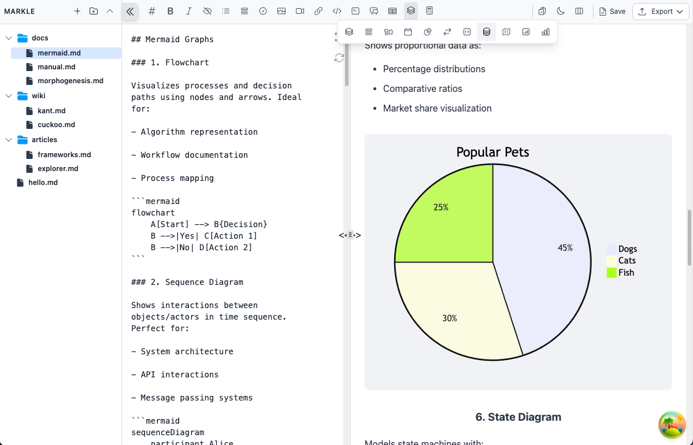
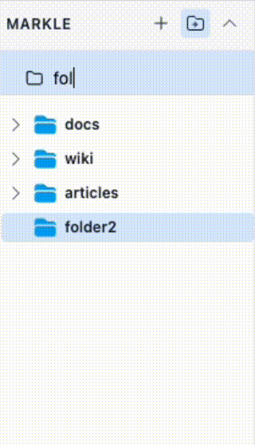

# merkle

An Electron application with React and TypeScript



### Explorer



### Main App


## Project Setup

### Install and swith the branch

```bash
$ npm install
$ git checkout new-main
```

### Build

```bash
$ npm run build

# For development
$ npm run dev

# For macOS
$ npm run build:mac

```

### For migrating and pising new database table

```bash
$ cd backend
$ npm run db:reset
$ npm run db:generate
$ npm run db:push
```
