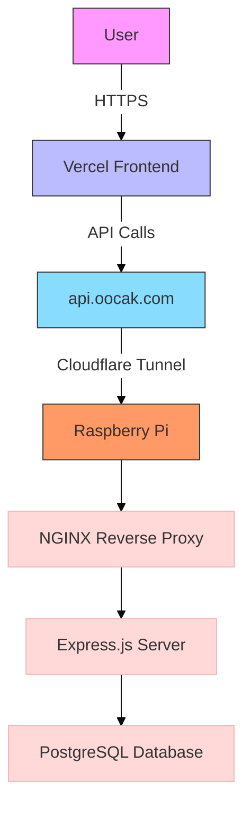
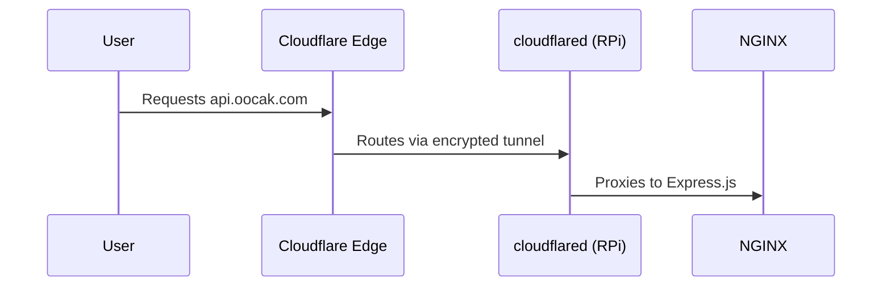
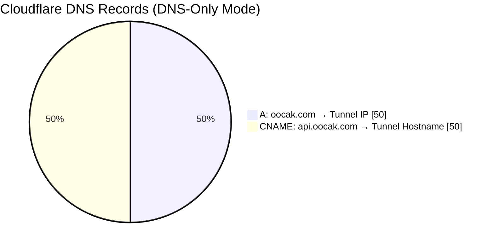
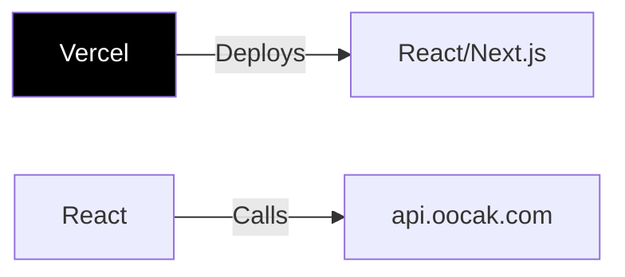

## Building a Secure and Scalable Architecture with Raspberry Pi, Cloudflare, and Vercel

### Architecture Overview

### Cloudflare Tunnel

Why?

No port forwarding → No exposed IPs.

Encrypted outbound connection from RPi to Cloudflare.

### DNS Configuration

### Vercel Frontend

